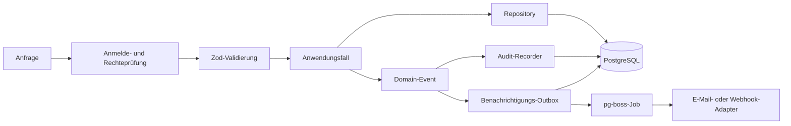

# Architektur

kramr ist ein **Modulmonolith** nach dem Prinzip Ports & Adapters: ein
Anwendungscontainer und eine PostgreSQL-Datenbank. Es gibt keinen eigenen
Worker-Container, keinen Redis und kein Backend-as-a-Service.

## Aufbau des Repositories

| Pfad | Inhalt |
| --- | --- |
| `apps/api` | Backend: NestJS, TypeScript, Drizzle ORM |
| `apps/web` | Frontend: React, Vite, Tailwind CSS |
| `packages/shared` | Gemeinsamer Vertrag: Zod-Schemas und Typen |
| `contracts` | Aus den Schemas erzeugtes OpenAPI-Dokument |
| `e2e` | Playwright-Tests der Kernabläufe |
| `ops` | Container-Image, Backup, Demodaten |

## Module

Das Backend besteht aus neun fachlichen Modulen: `catalog` (Material,
Kategorien, Parameter, Sets), `booking` (Buchung und Status), `availability`
(Überschneidungs-, Konflikt- und Restmengenberechnung), `contacts`, `iam`
(Anmeldung, Rollen, Sitzungen), `notifications` (E-Mail, Webhook, Outbox),
`audit` (Änderungshistorie), `settings` und `system` (Health, Version).

Jedes Modul ist intern geschichtet in `domain/` (reine Funktionen und Typen),
`application/` (Anwendungsfälle), `infrastructure/` (Repositories, Jobs) und
`http/` (Controller, Schemas). Module greifen nur über ihren Einstiegspunkt
aufeinander zu.

Wichtige Regeln:

- **Domänencode kennt kein Framework**, keine Datenbank und kein HTTP.
  Infrastruktur kommt über Ports, die das Modul selbst definiert.
- **Die Systemuhr wird nie direkt gelesen.** Zeit kommt über einen `Clock`-Port;
  das macht zeitabhängige Logik testbar.
- **Verfügbarkeit und Konflikte gibt es genau einmal**: im Modul `availability`.
  Buchungsübersicht, Konflikthinweis und öffentliche Verfügbarkeit rufen es
  auf, keine zweite Implementierung darf entstehen.

## Datenfluss einer schreibenden Anfrage

Jede Anfrage durchläuft die Sitzungsprüfung, die rollenbasierte Rechteprüfung
und die Schema-Validierung, bevor der Anwendungsfall läuft. Jede schreibende
Operation auf Buchung oder Material und jeder Rollenwechsel veröffentlicht ein
Domain-Event **in derselben Transaktion**. Der Audit-Recorder schreibt daraus
die Änderungshistorie, das Benachrichtigungsmodul legt Einträge in die Outbox.
Externe Wirkungen (E-Mail, Webhook) laufen **nie inline**, sondern über diese
Outbox.

## Hintergrundaufgaben

Sie laufen mit `pg-boss` im Anwendungsprozess:

- Erinnerungen und Überfälligkeits-Prüfung, täglich am Morgen, je Buchung,
  Ereignis und Kalendertag nur einmal.
- Zustellung der Outbox und Bereinigung alter Einträge, nachts.
- Konflikt-Nachprüfung nach einer Bestandsminderung, Bild-Ableitungen und
  Entfernen verwaister Bilder.
- Stündliche Sitzungsbereinigung ohne Job-Queue, weil sie vor dem Öffnen des
  HTTP-Ports laufen muss.

## Bewusste Auslassungen

- Kein Realtime-Layer. Falls einer nötig wird, ist die vorgesehene Form ein
  WebSocket-Layer mit PostgreSQL `LISTEN`/`NOTIFY`, kein Message-Broker.
- Kein Redis; Rollen-Cache und Rate-Limit liegen im Prozessspeicher, die
  Job-Queue in PostgreSQL.
- Keine generische Benachrichtigungsbibliothek, sondern zwei feste Adapter.
- Kein externer Suchdienst; die Suche nutzt PostgreSQL (`tsvector`, `pg_trgm`,
  `unaccent`).
- Migrationen sind handgeschriebenes, nummeriertes SQL mit eigenem Runner.
